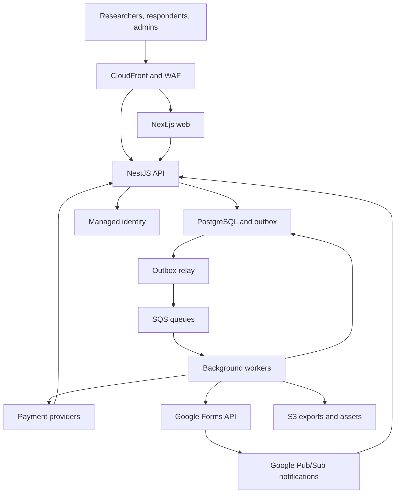
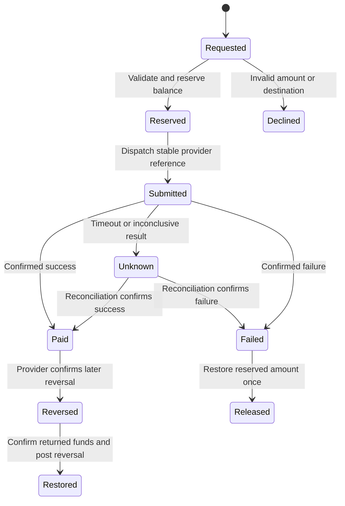
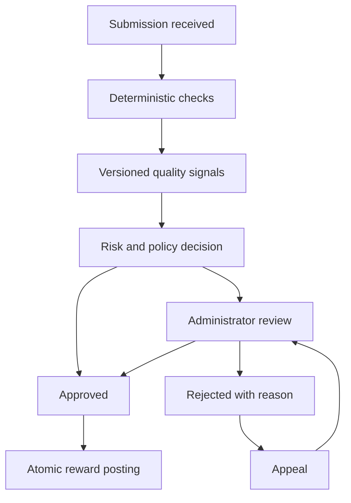

# Research Data Collection Platform — Architecture v0.1

**Prepared for Patrick Owusu Bofah · 20 September 2026**  
**Status:** Proposed technical architecture based on confirmed product requirements. This is a design deliverable; infrastructure, integrations, and performance have not yet been implemented or tested.

## 1. Architectural recommendation

Build a **Next.js / React / TypeScript frontend, NestJS / TypeScript backend, and PostgreSQL database**, with managed background processing and a provider-independent payments layer.

Start with a **modular monolith**: one backend codebase with explicit domain boundaries, deployed as an HTTP API and separate background workers. Keep transactions that approve responses, consume package entitlements, and credit wallets inside one PostgreSQL transaction. Scale the API and workers independently. This suits an initial small engineering team and gives the financial workflows a clear consistency boundary.

The core product combines questionnaire authoring, participant recruitment, response verification, and rewards. A payment package purchases a defined research outcome; each approved response creates a traceable obligation to a respondent. Reliable correlation, adjudication, and accounting are foundational features.

### Confirmed requirements and their implications

| Confirmed by the user | Architectural consequence |
| --- | --- |
| All researchers in Ghana and beyond | Researcher workspaces, internationalized interfaces, country and currency configuration, and provider routing. Actual payment and payout coverage must be enabled market by market. |
| Native questionnaires and existing Google Forms | Two collection adapters feeding a shared participation, submission, and verification model. |
| Researchers buy survey packages | Versioned package catalogue, checkout orders, explicit entitlements, campaign allocation, and refund rules. |
| Administrators set respondent earnings | Versioned reward policies; the reward offered to an accepted participant is frozen. |
| Mobile Money and bank cards | Hosted payment checkout and separate payout adapters. Card acceptance and card payouts are separate capabilities. |
| Respondents withdraw whenever they want | On-demand withdrawal requests against approved available earnings; no platform-imposed savings threshold or weekly withdrawal window. |
| Manual and automated verification | An explainable rules engine, administrator review queue, decision history, and appeals. |

Technical selections, numerical targets, initial feature limits, and business-policy recommendations below are proposals, not additional user requirements.

## 2. What comparable platforms teach us

Public product documentation supports the following patterns. It does not reveal competitors' private infrastructure or establish that they use our proposed stack.

| Reference | Observed public behavior | Design decision for this platform |
| --- | --- | --- |
| Prolific | Supports external research tools through links or APIs and emphasizes verified participants. | Separate participant identity and study participation from the questionnaire provider. [Prolific for researchers](https://www.prolific.com/researchers) |
| Prolific Protocol | Describes multiple quality layers and human handling of appeals. | Combine onboarding checks, response signals, ongoing abuse monitoring, and review with an appeal path. Do not promise perfect fraud detection. [Prolific quality system](https://www.prolific.com/resources/prolific-setting-standards-for-authentic-human-data-collection) |
| Qualtrics | Documents duplicate and bot checks; browser-cookie restrictions can be bypassed. | Enforce one reward entitlement per eligible participation in the database; treat device and network signals as supporting evidence. [Survey protection](https://www.qualtrics.com/support/survey-platform/survey-module/survey-options/survey-protection/), [fraud detection](https://www.qualtrics.com/support/survey-platform/survey-module/survey-checker/fraud-detection/) |
| Google Forms | Supports response retrieval and change notifications. | Ingest actual responses and reconcile them with issued participation identifiers before considering a reward. [Response API guide](https://developers.google.com/workspace/forms/api/guides/retrieve-forms-responses) |

Public industry patterns are inputs to our design. Package pricing, admin-set rewards, and withdrawal rules remain specific to this project.

## 3. Recommended technology stack

| Layer | Recommendation | Reason and boundary |
| --- | --- | --- |
| Web application | Next.js App Router, React, TypeScript | Public pages and authenticated dashboards in one application; interactive builder and respondent runner are client components. Business commands go to NestJS. [Next.js documentation](https://nextjs.org/docs/app) |
| UI | Tailwind CSS, shadcn/ui components | Consistent accessible primitives, responsive layouts, and control over the design. Accessibility still requires testing. |
| Client data and validation | TanStack Query, React Hook Form, Zod | Server-state caching, form editing, and runtime validation. Server validation remains authoritative. |
| Native survey rendering | SurveyJS Form Library behind a small adapter; a focused React question editor | Reuse the MIT-licensed rendering library and own a limited editor for the initial supported question types. [Form Library repository](https://github.com/surveyjs/survey-library) |
| Backend | NestJS on a supported Node.js LTS release, TypeScript, default Express adapter | Explicit modules, dependency injection, guards, and reusable application services for API and workers. [NestJS modules](https://docs.nestjs.com/modules) |
| Primary data | Managed PostgreSQL on Amazon RDS | Relational integrity, transactional updates, JSONB for survey definitions, and mature recovery options. |
| Data access | Prisma for ordinary queries and migrations; reviewed parameterized SQL for locks, RLS, and ledger posting | Developer productivity with database constraints preserved. Verify transaction and pooling behavior in the first technical spike. |
| Background work | Amazon SQS with dead-letter queues; transactional outbox in PostgreSQL | Durable jobs for verification, payouts, notifications, ingestion, and exports. Every consumer is idempotent. |
| Identity | Amazon Cognito via OIDC; opaque application session managed by the API | Managed identity lifecycle. Authorization, organization membership, and survey access stay in our database. |
| Assets and exports | Private Amazon S3 buckets, short-lived signed downloads | Isolate large objects from transactional tables and control export access. |
| Payments | Paystack as the initial Ghana candidate, behind collection and payout interfaces | Relevant Ghana payment rails; merchant eligibility and exact coverage must be validated before commitment. |
| Hosting | AWS ECS Fargate for web, API, and workers; CloudFront, WAF, load balancer | Managed container execution, independent scaling, consistent environments. |
| Infrastructure and delivery | Terraform, Docker, GitHub Actions, pnpm workspace | Repeatable environments, reviewed migrations, reproducible builds. |
| Observability | OpenTelemetry with CloudWatch logs, metrics, and trace storage | Correlate a checkout, submission, approval, and withdrawal across asynchronous work. |
| Testing | Jest, real PostgreSQL integration tests, Playwright, k6 | Verify business invariants, real concurrency behavior, browser journeys, and capacity. |

Pin stable, mutually compatible versions and security patches when implementation starts. Do not use unversioned dependencies or assume the latest major version is automatically the best deployment choice.

**Survey builder licensing:** SurveyJS Form Library is MIT-licensed, while Survey Creator requires a commercial developer license for production. The proposed initial editor avoids a production dependency on Creator. If sophisticated authoring is needed immediately, compare its license cost against building and maintaining those features before purchasing. [Creator licensing](https://github.com/surveyjs/survey-creator#licensing)

### Alternatives considered

| Choice | When it would be preferable | Decision now |
| --- | --- | --- |
| ASP.NET Core + PostgreSQL | A predominantly C# team or established Azure operating environment. Patrick's ASP.NET experience makes this a credible alternative. | NestJS is the default to keep frontend, API contracts, and background services in one language. C# remains a low-risk alternative before coding begins. |
| Django / DRF + PostgreSQL | A predominantly Python team or substantial Python-based research workflows. | Keep Python available for future isolated analysis jobs if needed. |
| MongoDB as the main database | A document-first system with fewer relational financial invariants. | PostgreSQL fits orders, permissions, quotas, and ledger entries; JSONB handles variable questionnaires. |
| Microservices with separate databases | Independent teams and demonstrated needs for isolated deployment or scaling. | Start with module boundaries. Extract a domain only after its load, ownership, or reliability requirements justify distribution. |
| Managed Redis | Demonstrated need for shared caching or rate limiting at application scale. | Optional later. Wallet balances, quotas, and job durability do not depend on it. |

## 4. System topology and ownership

The diagram shows logical interactions. Production requests reach container services through a load balancer. Payment webhook and Google push routes are authenticated integration endpoints. Native responses are stored through the API; user assets use constrained signed uploads.

Use the same public origin for browser pages and `/api/v1` routes. Authenticated responses are private and must not enter a shared CDN or Next.js cache. The frontend does not access PostgreSQL or payment secret keys.

### Backend domains

| Module | Owns | Main rule |
| --- | --- | --- |
| Identity and access | Users, sessions, workspace memberships, permissions | Derive access from the authenticated principal and resource ownership. |
| Surveys | Drafts, published versions, questions, consent versions | Published definitions are immutable. |
| Campaigns and recruitment | Eligibility, targeting, quotas, participation leases | A participation is admitted only when its capacity and reward budget can be reserved. |
| Packages and orders | Package versions, purchased entitlements, allocation | A successful verified payment activates exactly one order. |
| Collection adapters | Native submission validation and Google connection state | External identifiers are scoped by provider, connection, and form. |
| Verification | Signals, policies, decisions, appeals | A decision records evidence, actor, policy version, and reason. |
| Ledger and payouts | Journals, balances, reward entitlements, payout attempts | Only this module posts money movements; balances cannot be directly edited. |
| Reporting | Aggregate projections, exports, completion metrics | Reports never become the authority for payments. |
| Operations | Audit events, reconciliation, notifications, incident controls | Sensitive administrative actions are attributable and reviewable. |

Modules expose application services. They do not write one another's tables through arbitrary repositories. A coordinating application service may execute multiple module operations inside the same database transaction. Dependency checks enforce these boundaries in CI.

### Repository layout

| Path | Contents |
| --- | --- |
| `apps/web` | Next.js pages, role-specific interfaces, builder and respondent runner |
| `apps/api` | NestJS HTTP endpoints and composition root |
| `apps/worker` | Outbox relay, queue consumers, scheduled reconciliation |
| `packages/domain` | Business rules and state transitions, with no browser dependencies |
| `packages/contracts` | Versioned schemas and generated API client types |
| `packages/survey-engine` | Supported schema, conditions, renderer adapter, server validator |
| `packages/database` | Prisma model, reviewed SQL migrations, transaction helpers |
| `packages/ui` | Shared components and design tokens |
| `infra` | Terraform and environment configuration |

## 5. Identity, tenancy, and permissions

Create a workspace for each researcher or research organization. One person can belong to several workspaces and can also be a respondent; roles are memberships and grants, not a single permanent `user.role` field.

| Actor | Allowed access |
| --- | --- |
| Researcher workspace owner/editor | Own workspace's surveys, campaigns, packages, and permitted response data |
| Researcher analyst | Read approved datasets and reports where granted; no payout decisions |
| Respondent | Eligible campaign offers, own participations, own earnings and withdrawals |
| Quality reviewer | Assigned response evidence, verification decisions, and appeals |
| Finance administrator | Package/reward configuration, reconciliation, payout operations; minimal research-answer access |
| Platform administrator | Explicit elevated permissions; sensitive actions logged and subject to separation of duties |

Researcher data rows carry `workspace_id`. Use composite ownership constraints and PostgreSQL row-level security as defense in depth. Public campaign discovery exposes a deliberately limited projection; it does not grant respondents access to researcher tables. Respondent-owned rows have separate owner policies.

RLS context must be set transaction-locally on the checked-out connection. The normal runtime role must not own protected tables or possess `BYPASSRLS`; apply `FORCE ROW LEVEL SECURITY` where appropriate. Background jobs enter an explicit scoped context. Cross-tenant operations use narrow, audited service functions rather than a general unrestricted admin connection. Test policies through the actual connection pool. [PostgreSQL row security](https://www.postgresql.org/docs/current/ddl-rowsecurity.html)

Use OIDC authorization-code flow with PKCE, `state`, and `nonce`; exchange identity tokens on the server and issue an opaque, rotating, Secure/HttpOnly session cookie. Validate issuer, audience, signature, and expiry. Use CSRF protection and origin checks for cookie-authenticated mutations. Require MFA for administrators and step-up verification for payout-destination changes. [Cognito authorization flow](https://docs.aws.amazon.com/cognito/latest/developerguide/authorization-endpoint.html)

## 6. Data model and database invariants

Use UUID identifiers, UTC `timestamptz`, explicit status transitions, and optimistic version numbers on mutable configuration. Use currency codes with integer minor units; serialize large monetary integers as strings over JSON. Do not use binary floating point for money or assume every currency has two decimal places.

| Tables / entities | Important fields and relationships |
| --- | --- |
| `users`, `sessions`, `workspaces`, `memberships` | Identity subject, session expiry, workspace and permission grants |
| `respondent_profiles`, `consent_records` | Minimal eligibility attributes, consent purpose/version/time, verification status |
| `surveys`, `survey_versions` | Workspace, source type, immutable definition JSONB, schema hash, consent version |
| `package_versions`, `orders`, `order_lines` | Price/currency, package terms snapshot, paid amount, purchased entitlements |
| `campaigns`, `campaign_allocations`, `quota_buckets` | Survey version, allocated units, targeting, reward policy, state and capacity |
| `participations`, `slot_reservations` | Campaign, respondent, frozen reward/currency, expiry, unique correlation token hash |
| `submissions`, `submission_revisions` | Participation, source, schema version, immutable answer JSONB snapshot, provider revision evidence |
| `quality_runs`, `quality_signals`, `review_decisions`, `appeals` | Policy version, signal evidence, decision reason, actor and resolution |
| `reward_entitlements` | Unique participation/submission entitlement, frozen amount, approval journal link |
| `ledger_accounts`, `journal_entries`, `journal_lines`, `account_balances` | Currency, debit/credit lines, source event, posting state, rebuildable balance projection |
| `withdrawals`, `payout_attempts`, `payout_destinations` | Requested amount, reserved amount, provider reference, state, recipient token |
| `google_connections`, `external_form_bindings`, `sync_cursors` | Encrypted OAuth material, form ID, token-question mapping, watches, sync health |
| `webhook_inbox`, `outbox_events`, `processed_messages` | Deduplication keys, aggregate version, processing attempts, committed event payload |
| `audit_events`, `export_jobs`, `country_capabilities` | Actor/resource/action, export expiry, supported payment/payout rails and currencies |

Keep definitions and original answers in JSONB; project commonly analyzed answers into a separate reporting table with stable question IDs. Do not create a new SQL table for each survey. Preserve question type and option codes so exports are reproducible.

**Required database invariants:**

- One participation per respondent per campaign for the initial single-response product. Longitudinal studies later introduce explicit waves rather than weakening this uniqueness rule.
- One ordinary reward entitlement per accepted participation, and one posting for each unique financial business event.
- One external submission identity per `(connection_id, form_id, response_id)`; updates create revisions rather than new earnings.
- Journal lines balance for each currency. Posting requires a transaction-safe database function or equivalent constrained routine; after posting, journal rows are append-only. Corrections use linked reversing entries.
- The balance projection is updated atomically with journal posting and can be reconstructed from the journal. Available and reserved respondent balances never become negative.
- Campaign allocations cannot exceed purchased entitlements. Accepted responses plus active or review-held reservations cannot exceed allocated capacity.
- A row referencing a survey, campaign, or order must belong to the same workspace through composite foreign keys or equivalent constraints.
- API idempotency keys are scoped to actor and operation and store a request hash; reusing a key with different content returns a conflict.

Use row locks in a documented order for wallet and quota operations. Use serializable transactions selectively where multi-row predicates need protection, with bounded retries for serialization/deadlock errors. Never hold a database transaction open during a payment-provider HTTP request. These controls must be tested under concurrency. [PostgreSQL transaction isolation](https://www.postgresql.org/docs/current/transaction-iso.html)

Index tenant and time-based access paths, campaign/status lookups, pending jobs, provider references, and unique entitlement keys. Add JSONB indexes only for measured query needs. Reporting projections can lag; entitlement and wallet decisions use primary transactional data.

## 7. Native questionnaire lifecycle

Proposed first-release editor supports short/long text, single choice, multiple choice, dropdown, numeric input, date, rating/Likert items, sections, required fields, and simple conditional visibility. The survey-engine package defines an allowed JSON subset with stable question IDs. Its renderer adapter generates SurveyJS definitions; the server independently evaluates that same supported rule model.

Reject arbitrary JavaScript, custom executable expressions, unapproved remote choices, and unsafe HTML. Keep complex matrix logic, custom scripts, and sensitive file-upload question types outside the initial supported subset until their validation and accessibility paths are implemented.

1. Researcher edits a versioned draft and previews desktop/mobile behavior.
2. Publishing validates the definition, freezes a version, and binds consent and quality policy.
3. A campaign selects that version, a purchased package allocation, eligibility rules, and an administrator-approved reward policy.
4. A respondent sees the reward, expected duration, data-use notice, and eligibility before accepting.
5. Admission reserves a slot and reward budget transactionally. Autosave uses an authenticated participation, debounce/jitter, and optimistic revision checks.
6. Submit validates required visible fields, data types, lengths, option IDs, consent, and lease eligibility server-side. Save a receipt and move the reserved slot to review-held status in the same transaction.
7. Changes to an active questionnaire require a new published version and controlled campaign transition. Existing participations retain their original version and promised reward.

For interrupted connections, preserve server-side progress and clearly distinguish saved from unsaved answers. A retry uses the same submission idempotency key. Full offline submission and payment are not initial capabilities.

## 8. Google Forms integration

**A public Google Form link is enough to open a questionnaire, but it is insufficient evidence to credit a particular person's wallet.** A return to our website, a shared completion code, or a screenshot does not independently prove an accepted submission.

### Proposed connected mode

1. The researcher authorizes a dedicated Google connection with the minimum Forms read scopes. Google login to our platform is separate from this data-access grant. Store refresh tokens encrypted and restrict use to the integration worker.
2. Validate access to the chosen form and inspect its published settings. Have the researcher add a required platform participation-code question and provide its prefilled-link template. Perform a test submission to verify the question-ID mapping; do not assume an undocumented equivalence between link parameter IDs and API question IDs.
3. At admission, issue a high-entropy opaque code tied to one respondent, participation, campaign, and expiry. Store its hash, freeze the reward, and populate the dedicated question in the outgoing link. Put no name, email, or payout details in that code.
4. Pull actual responses through the authorized API. Match the returned code to a valid participation, deduplicate the provider response, persist the answer revision, and enter the shared verification pipeline.
5. Treat missing, changed, expired, or reused codes as exceptions requiring review. Prefilled answers are user-editable correlation aids, not cryptographic proof of who completed a Google Form. Account verification and abuse checks remain necessary.

Google documents prefilled links and editable responses. Our proposed token protocol builds on those capabilities and must be validated in the integration spike. [Google Forms sharing and prefill](https://support.google.com/docs/answer/2839588?hl=en)

Google change notifications are delivered through Cloud Pub/Sub, contain change metadata rather than answer content, and require fetching current data. Watches last one week unless renewed, and authorization revocation stops delivery. [Google Forms notifications](https://developers.google.com/workspace/forms/api/guides/push-notifications)

Our worker should renew watches ahead of expiry, run periodic catch-up scans with overlapping timestamps, and deduplicate by provider response identity and revision. Verify the Google push identity and audience, acknowledge only after durable inbox persistence, and keep cursor updates atomic with ingestion. Monitor revoked grants, suspended watches, API quotas, and schema drift.

Pause new admissions if the connection cannot reliably ingest responses. Preserve existing submitted work and route ambiguous cases to review. On schema changes, retain the captured schema hash and response revisions; do not silently treat answers as belonging to an old questionnaire version. Post-approval edits never issue a second reward.

### Unconnected links

Allow a researcher to save/share an ordinary Google Form URL, but require verified connected ingestion or an explicitly designed evidence-and-review workflow before enrolling paid respondents. This keeps both questionnaire options while making payment eligibility clear. Native-only metrics such as detailed page timings must be labeled unavailable for Google Forms; do not fabricate feature parity.

## 9. Survey packages, capacity, and reward commitments

**Proposed commercial interpretation:** each package defines approved-response units, eligible survey duration/targeting bands, supported markets, and service terms. The exact package prices, unit counts, expiry, and refund policy remain business decisions.

Record a package snapshot at purchase. Allocate purchased units to campaigns explicitly; support partial allocation rather than assuming every order belongs to one survey. The administrator's reward schedule is versioned by currency and applicable campaign band. Freeze the actual offer at participation admission. A later price change affects only new offers unless additional funding is explicitly allocated.

A campaign is published only when its package allocation and reward funding are valid. Capacity admission is atomic: lock the relevant allocation/quota buckets, verify eligibility, reserve capacity and budget, then issue the participation. Expired unsubmitted leases release capacity after a defined grace period. Submitted responses retain their capacity while verification is pending.

Do not immediately sell the slot of a provisionally rejected response when an appeal could still overturn the rejection. Keep capacity reserved through the appeal window, or fund replacement/appeal exposure from an explicit platform reserve. Campaign closure stops admissions while valid admitted participants can finish under their frozen terms.

Publish package feasibility before accepting payment. Narrow targeting does not guarantee that enough eligible respondents exist. Show estimated availability and define partial fulfillment, expiry, and refund behavior. Refunds may cover only uncommitted refundable value; posted respondent earnings must not disappear because a researcher cancels or disputes an order.

## 10. Payments, wallets, and withdrawals

### Provider strategy

Paystack is the initial candidate for a Ghana operating entity: its payment documentation includes cards and Ghana Mobile Money. Its transfer documentation lists supported business markets and Ghana bank/Mobile Money recipients. This is a capability lead, not confirmed merchant approval or a promise of worldwide coverage. [Payment channels](https://paystack.com/docs/payments/payment-channels/), [transfer availability](https://paystack.com/docs/transfers/), [recipient types](https://paystack.com/docs/transfers/creating-transfer-recipients/)

Define separate interfaces for `PaymentCollectionProvider` and `PayoutProvider`, including initialize/verify payment, refund, create recipient, send payout, check status, and fetch reconciliation records. Resolve providers using merchant entity, country, currency, and operation. Persist provider identity on each order and payout attempt.

Design for international researchers immediately, and activate paid respondent markets only after collection, payout, identity, and operational requirements are satisfied. Maintain a capability matrix in configuration. Additional providers can be added without rewriting the ledger. A card used to buy a package is not automatically an eligible withdrawal destination; verify card-payout support separately.

### Payment intake

The API creates a pending order with an immutable expected amount and currency, then initializes hosted checkout. On return, the UI displays pending status until the backend has verified payment. Do not trust browser-supplied prices or success redirects.

Validate webhook signatures over the raw request body, durably record the event, then acknowledge quickly. For Paystack, the documented signature is HMAC-SHA512. Deduplicate by documented provider identifiers or a stable event identity, and independently verify amount, currency, merchant/reference, and final status against the order before funding it. [Paystack webhooks](https://paystack.com/docs/payments/webhooks/)

State changes are guarded against duplicate and out-of-order events. Payment success plus allocation eligibility is written transactionally; downstream work is written to the outbox in the same commit.

### Ledger model

Use an append-only double-entry operational subledger, with separate accounts per currency. The UI shows projected pending earnings from unapproved submissions, approved available earnings, withdrawals in progress, and paid history. Projected earnings are not withdrawable cash.

An account has a separate balance for each supported currency; never add different currencies into one spendable number. Initially fund a campaign and pay its rewards in the same supported currency. If currency conversion is introduced, persist the quoted rate, expiry, fees, source and destination amounts, and rounding adjustments, with independently balanced currency legs and FX clearing accounts. The first version must not silently convert or promise an unavailable payout currency.

Illustrative postings below show principal movements; provider fees, taxes, platform revenue recognition, and refunds need explicit accounts and a reviewed accounting mapping before live operations.

| Event | Debit | Credit |
| --- | --- | --- |
| Package payment captured | Provider receivable | Unallocated package funding |
| Reward budget allocated | Unallocated package funding | Campaign reward funding |
| Verified response approved | Campaign reward funding | Respondent available earnings |
| Withdrawal accepted | Respondent available earnings | Withdrawal pending liability |
| Payout confirmed successful | Withdrawal pending liability | Provider cash/balance asset |
| Payout definitively failed | Withdrawal pending liability | Respondent available earnings |

Settlement moves provider receivables into the appropriate bank/provider cash account and records fees separately. The unallocated package balance is not automatically profit. Funding holds and contingent commitments are tracked separately from physical cash availability.

Approve a response, consume one entitlement, post its reward, update balance projections, and emit the outbox event in **one database transaction**. If any step fails, all steps roll back. Only the ledger module can perform these postings.

### Withdrawal workflow

1. An authenticated respondent requests any positive representable amount up to their available balance, with no platform savings threshold.
2. Revalidate the destination, perform any required step-up, and reserve funds inside a locked transaction. Persist the withdrawal and outbox event together.
3. A worker creates an attempt and immutable provider reference before the external call. Queue delivery, crashes, and retries must reuse that reference while the result is inconclusive.
4. A pending response stays pending. A timeout is **unknown**, not failed; keep its reservation and check the provider. Never fail over to a second provider while the first might already have paid.
5. Confirmed success finalizes the payout once. Definitive failure releases the reservation once. A provider-confirmed later reversal is a new audited event with its own posting, not a rewrite of history.

Paystack specifically documents retaining a transfer reference to avoid double crediting on retries. [Single-transfer references](https://paystack.com/docs/transfers/single-transfers/)

**Meaning of “withdraw anytime”:** the platform accepts on-demand requests for approved earnings without a platform minimum or weekly schedule. Provider minimum transfer units, fees, availability, and settlement delays still exist. Validate that the chosen rails can support the smallest promised payout; do not silently add a platform threshold. Package margins or a platform subsidy may need to absorb small-payout fees. Any unsupported market or amount must be resolved before promising that capability.

Reconcile internal journals, provider transactions, and actual cash/settlement records daily and after incidents. Monitor available provider liquidity separately from respondent liabilities. Use a funded platform reserve for fees, chargebacks, and approved obligations during settlement delays; approval must not depend on attempting to claw back another respondent's paid earnings.

## 11. Verification, fairness, and appeals

Proposed pipeline:

Deterministic checks cover active participation, matching survey version, required answers, valid option values, valid external correlation, and duplicate entitlement attempts. Quality signals can include implausibly fast completion, failed disclosed attention checks, repetitive answering patterns, or bursts from related accounts.

Treat shared IP addresses, device changes, and imperfect English as insufficient grounds for automatic rejection. A campus, household, or mobile carrier may serve many legitimate respondents. Do not make an opaque AI-text classifier the authority for payment. Track false positives and appeal reversals by rule.

For the initial controlled pilot, run automated scoring and have an administrator review every payment-bearing decision. After calibration, permit audited low-risk auto-approval under a versioned policy and retain manual review for flagged cases and random samples. An initial review-time target can be 48 hours, subject to staffing; it must not become an unstaffed promise.

Researchers may flag quality concerns but cannot arbitrarily change balances. Reviewers see evidence and reason codes, and conflicts of interest exclude them from reviewing their own studies. Final decisions and appeal outcomes are immutable events. Reversing a decision uses compensating ledger entries if necessary, with explicit authorization.

## 12. API and event contracts

Use REST JSON under `/api/v1`, documented with OpenAPI. Generate client types, validate payloads at runtime, return stable error codes, paginate large collections, and enforce payload limits. Never accept `workspace_id`, `respondent_id`, or administrative privilege from a request as proof of access.

| Representative endpoint | Purpose / protection |
| --- | --- |
| `POST /workspaces/{id}/surveys` | Create owned draft; workspace authorization |
| `POST /surveys/{id}/versions` | Validate and publish immutable definition |
| `POST /orders` | Purchase quoted package version; idempotency key |
| `POST /campaigns` | Allocate purchased capacity and reward budget |
| `POST /campaigns/{id}/participations` | Eligibility and atomic admission |
| `PUT /participations/{id}/draft` | Owner-only autosave with revision precondition |
| `POST /participations/{id}/submissions` | Idempotent submit and frozen schema validation |
| `POST /admin/submissions/{id}/decisions` | Evidence-based review, permission and optimistic state check |
| `POST /submissions/{id}/appeals` | Owner-only appeal against a decision |
| `GET /me/wallet` | Ledger-derived balances by currency |
| `POST /me/withdrawals` | Step-up as needed, balance reservation, idempotency |
| `POST /integrations/google/connect` | Initiate scoped OAuth flow |
| `POST /webhooks/paystack` | Raw-body signature validation and durable inbox |
| `POST /integrations/google/notifications` | Authenticated Pub/Sub delivery and durable inbox |
| `POST /campaigns/{id}/exports` | Authorized asynchronous export with expiring download |

Events such as `OrderFunded`, `ParticipationSubmitted`, `SubmissionApproved`, `WithdrawalRequested`, and `PayoutConfirmed` carry an event ID, schema version, aggregate ID/version, correlation ID, and scoped ownership. They contain references rather than complete research answers or payout credentials.

Use a transactional outbox to avoid losing a job after its business transaction commits. Delivery is at least once; consumers track processed events and use guarded state transitions. Handle ordering with aggregate versions and state checks. Split operational, payout, and export queues so a large export cannot starve payments. [AWS outbox pattern](https://docs.aws.amazon.com/prescriptive-guidance/latest/cloud-design-patterns/transactional-outbox.html)

## 13. Security, privacy, and research data handling

Use **OWASP ASVS 5.0 Level 2 as a proposed verification baseline** and **WCAG 2.2 AA as an accessibility target**. These are testable targets, not certifications already achieved. [OWASP ASVS](https://owasp.org/projects/asvs), [WCAG 2.2](https://www.w3.org/TR/WCAG22/)

- Encrypt transport, managed storage, OAuth refresh tokens, and sensitive payout metadata. Keep secrets in Secrets Manager and use task-scoped IAM roles.
- Use hosted checkout so raw card numbers and CVV do not enter our application or logs. Confirm the resulting merchant compliance scope with the provider.
- Separate identity/payout data from research answers. Researchers normally receive study-specific pseudonyms, not the respondent's wallet identity or global account identifier.
- Record survey-specific consent and data-use purpose. The paid-account relationship means the platform can link participation to a person; do not market this as complete anonymity.
- Sanitize research-authored text, restrict links/assets, protect against CSV formula injection in exports, and impose file/content limits. No survey-supplied executable code.
- Apply short-lived signed export URLs, download authorization, audit events, and object expiry. Do not place research answers, session tokens, or raw device identifiers in telemetry.
- Define retention and deletion by data class. Research answers, security evidence, identity verification, and financial records have different purposes and retention needs. Use pseudonymization/tombstones to preserve necessary financial integrity without retaining unnecessary profile data.
- Establish controller/processor roles, privacy notices, permitted study categories, age eligibility, cross-border transfer terms, and deletion obligations for target jurisdictions. EU data protection may apply depending on activities and users; implementation controls alone do not establish legal compliance. [European Commission framework](https://commission.europa.eu/law/law-topic/data-protection/legal-framework-eu-data-protection_en)
- Require two-person authorization for changes such as bulk ledger adjustments or payout-provider configuration. Normal valid respondent withdrawals remain automated under policy.

Country-specific privacy and payment onboarding requirements must be confirmed before entering each market. A wallet subledger records amounts owed; it does not establish permission to operate a regulated stored-value service. Verify the operating model with the payment partner before handling live money.

## 14. Deployment, reliability, and operations

### Production topology

Use separate development, staging, and production environments with separate identities, secrets, payment credentials, databases, and buckets. Deploy web/API containers across two availability zones. Use RDS PostgreSQL Multi-AZ with encrypted backups and point-in-time recovery. Workers can scale independently with queue depth. Keep the database private and restrict external egress to required integrations.

Choose a primary region after measuring latency from Ghana and target markets and assessing data-location requirements. Ireland is a candidate, not an assumed best location. Start with one transactional write region to keep ledger and quota decisions coherent; use CDN delivery for public assets. Later add regional data partitions where justified by latency or residency requirements.

Terraform defines infrastructure and access. CI checks types, tests, migrations, dependency licenses, and security findings before deployment. Use backward-compatible expand/migrate/contract database changes. Application rollback must remain compatible with the current schema; destructive data rollback is a separate recovery operation.

### Proposed targets to validate

| Area | Initial target, subject to benchmark and operating budget |
| --- | --- |
| Planning envelope | 10,000 monthly active users, 1 million retained responses, and bursts of 50 final submissions/second; explicitly include autosave and external-ingestion load in testing |
| Availability | 99.9% monthly for core submission and wallet-request API journeys; separately report provider outages |
| API latency | p95 below 500 ms for ordinary API operations excluding external network calls and large exports |
| Submission acknowledgement | p95 below 1 second at the agreed load, with durable receipt before success is shown |
| Disaster recovery | Proposed RPO at most 5 minutes and RTO at most 60 minutes; demonstrate in a restore drill |
| Critical correctness | Zero duplicate reward postings, zero duplicate successful payout effects, and zero negative available balances in concurrency and fault tests |
| Google ingest freshness | Track source-to-ingest lag; initially alert if a healthy connection falls more than 10 minutes behind |

These figures are engineering targets, not measured capabilities or guaranteed service levels. A confirmed traffic forecast, staffing model, and budget will determine final SLOs and sizing.

Operational dashboards should cover payment verification lag, unknown withdrawals, provider liquidity versus liabilities, journal reconciliation differences, review backlog, appeal outcomes, Google token/watch health, queue age, failed exports, and database saturation. Use correlation IDs throughout and alert on symptoms that affect users.

Maintain runbooks for payout-provider outage, possible duplicate payment, payment-key rotation, failed reconciliation, Google authorization revocation, tenant data exposure, and database recovery. After restoring a database, reconcile with external providers before replaying payouts; the external money movement may have completed after the restored checkpoint.

### Capacity and cost discipline

Set infrastructure budgets before provisioning. Estimate containers, Multi-AZ database, load balancer, NAT/egress, logs, backups, storage, authentication/SMS, verification services, Google Pub/Sub, and payment fees using the actual region and traffic assumptions. Multi-AZ production has a standing cost even with few users. Development can use smaller single-instance resources and synthetic data.

Optimize indexes, pagination, payload sizes, and worker concurrency first. Introduce reporting replicas/materialized projections when dashboards pressure the primary. Add Redis only for measured caching/rate-limit needs. Consider extracting integrations or reporting before the ledger; separating money ownership creates additional reconciliation and consistency work.

## 15. Failure scenarios and release gates

| Scenario to test | Required result |
| --- | --- |
| Two admins approve the same response simultaneously | One decision takes effect, one entitlement is consumed, one reward is posted. |
| Multiple respondents compete for the final slot | Capacity remains within the funded allocation; accepted participants keep their promises. |
| One respondent submits concurrently from multiple tabs | One accepted submission/reward entitlement; deterministic repeat receipt or conflict. |
| Two simultaneous withdrawals use the same balance | Atomic reservations prevent overspending. |
| Client retries a withdrawal after losing its response | The same request key returns the existing withdrawal. |
| Payout is accepted externally but the worker crashes | Reconcile/retry the persisted reference; do not send a new independent payment. |
| Webhooks are duplicated, delayed, or out of order | Signature checks, inbox deduplication, and state guards preserve correctness. |
| Provider later reverses a successful payout | Append a distinct reversal event and verified compensating posting. |
| Outbox relay crashes after publishing but before marking sent | Redelivery creates no duplicate business effect. |
| Researcher changes or revokes a Google Form | Detect drift, preserve evidence, pause unsafe new admissions, and review unresolved participations. |
| External submission arrives after lease expiry | Apply recorded expiry/grace rules; never silently exceed campaign funding. |
| Rejection is overturned after capacity was released | Honor the original reward using held capacity/funding or an explicit platform reserve. |
| User swaps another workspace's resource ID | API and database policies deny access, including background exports. |
| Database is restored to an earlier point | Payout dispatch stays paused until provider reconciliation prevents replays. |
| Poor mobile connectivity during submission | Preserve drafts; show an accurate receipt state; retries cannot double-submit. |

Use real PostgreSQL in integration tests, not an in-memory replacement for lock/RLS behavior. Add property-based tests for ledger conservation and allowed state transitions, provider contract tests, and browser tests covering the three roles. A controlled live payment/payout pilot is needed after sandbox validation and merchant activation; do not treat a provider's always-successful test transfer as evidence for production failure handling.

No live-money launch until reconciliation, restore testing, tenant-isolation tests, payment failure drills, and an end-to-end withdrawal have passed with responsible operational owners assigned.

## 16. Implementation sequence and decisions still needed

| Phase | Deliverable | Exit condition |
| --- | --- | --- |
| 1. Validate integrations and economics | Google correlation prototype; merchant/payout capability matrix; package/reward model; small-withdrawal fee analysis | Demonstrated response matching and an approved route to fund and pay respondents in each initial market |
| 2. Foundation | Repository, environments, identity, tenancy, migrations, audit, outbox, ledger core | Isolation and financial-concurrency tests pass |
| 3. Native end-to-end slice | Package checkout, native survey, participation, automated signals, admin approval, wallet, sandbox withdrawal | One full researcher-to-respondent flow with retry and failure scenarios |
| 4. Google Forms and operations | OAuth onboarding, ingestion/reconciliation, schema drift, appeals, exports, finance dashboards | Connected Google Forms use the same verified reward flow |
| 5. Production pilot | Limited real users, funded provider balance, reconciliation, recovery drills, accessibility and load tests | Defined launch gates pass; both native and connected Google collection are supported |
| 6. Expansion | Additional country/provider adapters, richer questionnaire authoring, calibrated auto-approval, institutional access | Market capability and operational readiness confirmed independently |

Implement the difficult external and financial flows early. Rich dashboard polish and advanced authoring can follow once the full money-and-response path works.

### Business inputs still needed

1. **Operating entity and first paid markets:** where the business is registered, the first currencies, and where respondents must be payable at launch. The product audience remains international.
2. **Package definitions and reward policy:** package prices, approved-response quantities, targeting/duration bands, expiry/refunds, reward-setting process, and who funds transfer fees and chargebacks.
3. **Operating capacity:** team size, cloud budget, initial usage forecast, who reviews responses, appeal turnaround, and responsibility for finance reconciliation.
4. **Research scope:** permitted study/data categories, minimum participant age, retention expectations, and whether institutions need SSO or team collaboration at launch.

These inputs refine the design; the proposed module boundaries, relational data model, idempotent integrations, and ledger invariants can guide implementation planning now. The next engineering artifacts should be architecture decision records, a reviewed logical schema, OpenAPI contracts, and an executable Google/Paystack integration spike before broad feature development.
